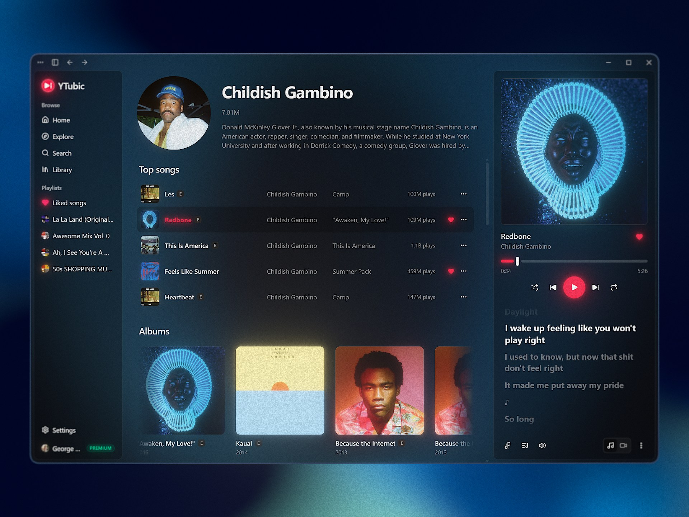

<p align="center">
  
</p>

<h1 align="center">PiYTmusic</h1>

<p align="center">
  A fast, responsive YouTube Music desktop client for Windows and Raspberry Pi.
</p>

<p align="center">
  <a href="LICENSE"></a>
</p>

<p align="center">
  <a href="../../releases/latest">
    
  </a>
</p>

Built as a reaction to the sluggish webview-wrapper experience — PiYTmusic talks to YouTube's InnerTube API directly, renders its own UI, and caches aggressively, so navigation and playback feel instant.



## Features

- **Fast and responsive UI** — instant navigation with prefetch and aggressive caching; no page reloads, no spinners on every click
- **Flexible player layouts** — dock the player at the bottom or as a right-side panel
- **Floating player widget** — pop the player out into a compact always-on-top window
- **Synced lyrics** — line-by-line synced lyrics from multiple providers (LRCLIB, Musixmatch, Genius)
- **Hi-res cover art** — upgrades album covers to high-resolution studio art when available
- **Full library support** — your playlists, likes, albums and artists; search with filters; radio/autoplay queues
- **OS integration** — media keys and tray icon; System Media Transport Controls on Windows, MPRIS on Linux
- **Auto-updates** — the app updates itself from GitHub Releases, and keeps its yt-dlp copy fresh automatically
- **Runs on a Raspberry Pi** — Pi 4/5 on 64-bit Raspberry Pi OS, with [documented caveats](docs/raspberry-pi.md)

> **Disclaimer:** PiYTmusic is an unofficial client. It is not affiliated with,
> endorsed by, or sponsored by Google or YouTube. "YouTube" and "YouTube Music"
> are trademarks of Google LLC. The app streams audio through
> [yt-dlp](https://github.com/yt-dlp/yt-dlp) and may stop working at any time if
> YouTube changes its internals. Use at your own risk.

## Install

Download the latest installer from the [Releases](../../releases) page and run it.

- **Windows 10/11**, or **Raspberry Pi 4/5** on 64-bit Raspberry Pi OS
  (build from source — see [docs/raspberry-pi.md](docs/raspberry-pi.md),
  which also lists what the Pi build can't do).
- On first launch the app downloads its own copy of yt-dlp (~12 MB) into its
  data folder and keeps it updated automatically.
- Signing in is optional: browse and playback work anonymously; sign in to get
  your library, likes, and playlists.

### FAQ

**Windows says "Windows protected your PC" (SmartScreen).**
The installer is not code-signed (certificates are expensive for a free
open-source project). Click "More info" → "Run anyway". The source code is
public — you can audit it or build it yourself.

**My antivirus flags the app / yt-dlp.**
yt-dlp is a widely-used open-source downloader that some AV vendors
false-positive on. The binary is downloaded directly from yt-dlp's official
GitHub releases.

**Will Google ban my account for using this?**
Browsing/search/library requests look identical to the official web app, and
audio streaming is fully anonymous (never tied to your account). There are no
known cases of accounts being banned for third-party players — but no
guarantees; see the disclaimer above.

**Playback suddenly stopped working.**
YouTube periodically changes its streaming internals. yt-dlp usually ships a
fix within days, and the app picks it up automatically (it self-updates its
yt-dlp copy every ~3 days). Restarting the app forces the check.

## Stack

- **Shell:** Tauri 2 (Rust backend, system webview — WebView2 on Windows, WebKitGTK on Linux)
- **Frontend:** React 19 + TypeScript
- **Build:** Vite 7
- **Styling:** Tailwind CSS v4
- **Components:** shadcn/ui (new-york style, neutral base, YouTube red accent)
- **Routing:** TanStack Router (file-based, type-safe, prefetch on intent)
- **Data:** TanStack Query
- **Client state:** Zustand
- **Icons:** lucide-react

## Dev

```bash
pnpm install
pnpm tauri dev
```

Frontend-only dev (no Tauri window): `pnpm dev`.

## Quality checks

```bash
pnpm test         # vitest unit tests (pure parsers/matchers)
pnpm lint         # eslint
pnpm format       # prettier --write
pnpm build        # tsc + vite production build
```

CI (`.github/workflows/ci.yml`) runs typecheck, lint, tests, build and
`cargo check` on every push / PR.

## Project layout

```
src/
├── routes/              # TanStack Router file-based routes
├── components/
│   ├── ui/              # shadcn primitives
│   ├── layout/          # AppShell, sidebar, topbar, player bar, floating player, lyrics
│   └── shared/          # Track list/rows, cards, shelves, context menus
├── lib/
│   ├── innertube/        # Raw InnerTube client + parsers
│   ├── lyrics/          # LRCLIB / Musixmatch / Genius sources + LRC parser
│   ├── store/           # Zustand stores
│   ├── audio-engine.ts  # Playback engine
│   ├── stream.ts        # Stream URL resolver (localhost proxy)
│   └── utils.ts         # cn() and friends
└── hooks/
src-tauri/               # Rust backend (axum stream proxy, cookies, tray)
```

## Credits

- **[YTubic](https://github.com/NUber-dev/YTubic) by George Shyshov** — PiYTmusic is
  a fork of YTubic, renamed and extended with the Raspberry Pi port. All of the
  original client is his work, used and redistributed under the GPL-3.0.
- [yt-dlp](https://github.com/yt-dlp/yt-dlp) — audio streaming
- [LRCLIB](https://lrclib.net) — synced lyrics
- Musixmatch and Genius — lyrics sources
- [Tauri](https://tauri.app), [shadcn/ui](https://ui.shadcn.com),
  [TanStack](https://tanstack.com), and the rest of the stack above

## License

[GPL-3.0](LICENSE) — free to use, modify, and redistribute; derivative works
must stay open source under the same license.
